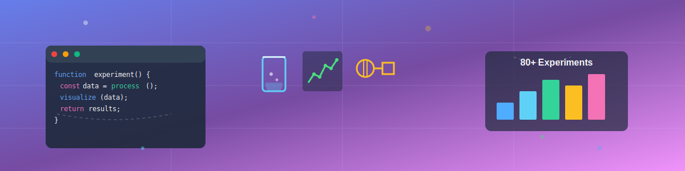
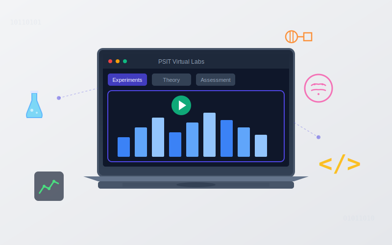
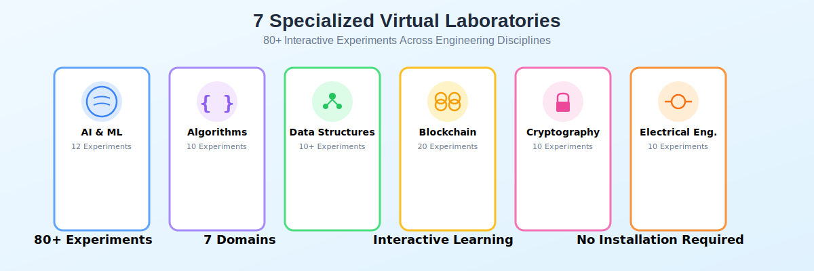
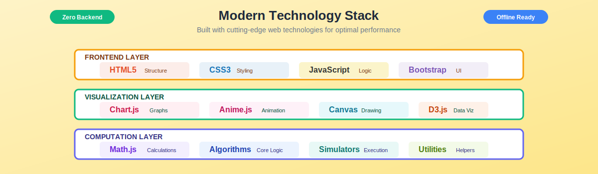

<p align="center">
  
</p>

<h1 align="center">🔬 PSIT Virtual Labs</h1>

<p align="center">
  <strong>Empowering Engineering Education Through Interactive Virtual Experiments</strong>
</p>

<p align="center">
  <a href="https://psit-virtual-labs.vercel.app/">
    
  </a>
  
  
</p>

<p align="center">
  
  
  
</p>

<p align="center">
  
</p>

---


## 🎯 About The Project

<p align="center">
  
</p>

**PSIT Virtual Labs** is an innovative digital learning ecosystem designed specifically for students at **Pranveer Singh Institute of Technology (PSIT)**. This platform bridges the gap between theoretical knowledge and practical application by offering:

- 🧪 **80+ Interactive Experiments** across 7 engineering disciplines
- 📊 **Real-time Visualizations** for complex algorithms and data structures
- 🎓 **Structured Learning Paths** from fundamentals to advanced concepts
- 🌐 **Accessible Anywhere** - completely browser-based, no installation needed
- 📱 **Responsive Design** - seamless experience on all devices

### Why Virtual Labs?

> *"The future of education lies in making learning accessible, interactive, and engaging. PSIT Virtual Labs transforms traditional laboratory experiences into immersive digital simulations that students can access 24/7."*

Traditional laboratory sessions are often constrained by:
- ⏰ Limited lab hours and equipment availability
- 📍 Physical presence requirements
- 🔬 Safety concerns with certain experiments
- 💰 High costs of equipment and maintenance

**Our Solution:** A comprehensive virtual environment where students can experiment, fail, learn, and succeed without these limitations.

---

## ✨ Key Features

<table>
<tr>
<td width="50%">

### 🎨 Interactive Simulations
- Real-time algorithm visualizations
- Step-by-step execution controls
- Customizable input parameters
- Instant feedback mechanisms

</td>
<td width="50%">

### 📚 Comprehensive Coverage
- 7 specialized laboratory domains
- 80+ hands-on experiments
- Theory integrated with practice
- Industry-relevant content

</td>
</tr>
<tr>
<td width="50%">

### 🧠 Smart Assessment
- Pre-tests to gauge readiness
- Post-tests for knowledge validation
- Instant result analytics
- Performance tracking

</td>
<td width="50%">

### 🚀 Modern Tech Stack
- Pure HTML5/CSS3/JavaScript
- No backend dependencies
- Lightning-fast performance
- Cross-platform compatibility

</td>
</tr>
</table>

---

## 🎓 Learning Methodology

Our unique **5-step learning framework** ensures comprehensive understanding:

<p align="center">
  
</p>


| Step | Description | Benefit |
|------|-------------|---------|
| **1️⃣ Theory** | Comprehensive concept explanation with examples | Build foundational understanding |
| **2️⃣ Pre-Test** | Multiple-choice questions to assess readiness | Identify knowledge gaps |
| **3️⃣ Simulation** | Hands-on interactive experiment | Apply concepts practically |
| **4️⃣ Post-Test** | Evaluate comprehension after practice | Measure learning outcomes |
| **5️⃣ Feedback** | Detailed performance analysis | Continuous improvement |

---

## 🧪 Virtual Labs Portfolio

<p align="center">
  
</p>

### 1. 🤖 Artificial Intelligence & Machine Learning Lab

<details>
<summary><b>12 Cutting-Edge ML Experiments</b> - Click to expand</summary>

| Exp # | Experiment Name | Key Concepts | Difficulty |
|:-----:|-----------------|--------------|:----------:|
| 1 | NumPy & Pandas Data Operations | Array manipulation, DataFrames | ⭐ |
| 2 | Exploratory Data Analysis (EDA) | Statistical analysis, Visualization | ⭐⭐ |
| 3 | Data Preprocessing Pipeline | Cleaning, Normalization, Encoding | ⭐⭐ |
| 4 | Linear Regression Simulation | Supervised Learning, Gradient Descent | ⭐⭐ |
| 5 | Logistic Regression Classifier | Binary Classification, Sigmoid | ⭐⭐ |
| 6 | Decision Tree Visualization | Tree-based Models, Splits | ⭐⭐⭐ |
| 7 | K-Means Clustering | Unsupervised Learning, Centroids | ⭐⭐⭐ |
| 8 | K-Nearest Neighbors (KNN) | Distance Metrics, Classification | ⭐⭐ |
| 9 | Support Vector Machine (SVM) | Hyperplanes, Kernel Tricks | ⭐⭐⭐ |
| 10 | CNN Convolution Simulator | Deep Learning, Feature Maps | ⭐⭐⭐⭐ |
| 11 | Model Evaluation Metrics | Accuracy, Precision, Recall, F1 | ⭐⭐ |
| 12 | Hyperparameter Tuning (GridSearch) | Optimization, Cross-validation | ⭐⭐⭐ |

**🎯 Learning Outcomes:**
- Master fundamental ML algorithms
- Understand data preprocessing techniques
- Implement deep learning concepts
- Evaluate model performance effectively

</details>

---

### 2. 📊 Design & Analysis of Algorithms Lab

<details>
<summary><b>10 Algorithm Complexity Experiments</b> - Click to expand</summary>

| Exp # | Experiment Name | Algorithm Category | Time Complexity |
|:-----:|-----------------|-------------------|:---------------:|
| 1 | Recursive Search Algorithms | Searching | O(n), O(log n) |
| 2 | Basic Sorting Suite | Sorting | O(n²) |
| 3 | Advanced Sorting Techniques | Sorting | O(n log n) |
| 4 | Non-Comparison Sorts | Sorting | O(n+k), O(d(n+k)) |
| 5 | Shell Sort Implementation | Sorting | O(n log n) |
| 6 | Greedy Algorithm Strategies | Optimization | Varies |
| 7 | Breadth-First Search (BFS) | Graph Traversal | O(V+E) |
| 8 | Depth-First Search (DFS) | Graph Traversal | O(V+E) |
| 9 | Dijkstra's Shortest Path | Graph Algorithms | O(V²) |
| 10 | Backtracking Solutions | Problem Solving | Exponential |

**📈 Features:**
- Visual complexity analysis
- Step-by-step execution
- Comparative performance metrics
- Interactive input customization

</details>

---

### 3. 🗂️ Data Structures Lab

<details>
<summary><b>10+ Fundamental DS Experiments</b> - Click to expand</summary>

#### Sorting Algorithms (6 Experiments)
- **Bubble Sort** - Compare and swap visualization
- **Selection Sort** - Minimum element selection
- **Insertion Sort** - Element insertion in sorted portion
- **Merge Sort** - Divide and conquer approach
- **Quick Sort** - Pivot-based partitioning
- **Heap Sort** - Binary heap operations

#### Searching Algorithms (2 Experiments)
- **Linear Search** - Sequential scanning
- **Binary Search** - Divide and conquer search

#### Linear Structures (3 Experiments)
- **Stack Operations** - LIFO operations (Push, Pop, Peek)
- **Queue Implementation** - FIFO operations (Enqueue, Dequeue)
- **Circular Queue** - Efficient memory utilization

#### Graph Algorithms (4 Experiments)
- **Graph Traversal** - BFS & DFS implementations
- **Minimum Spanning Trees** - Kruskal's & Prim's algorithms
- **Shortest Path** - Dijkstra's algorithm
- **Graph Representation** - Adjacency matrix & list

#### Applications (2 Experiments)
- **Polynomial Operations** - Add, subtract, multiply polynomials
- **Tower of Hanoi** - Recursive puzzle solving

**🎨 Interactive Features:**
- Animated step-by-step visualization
- Speed control (slow/medium/fast)
- Custom input arrays
- Complexity analysis display

</details>

---

### 4. ⛓️ Blockchain Technology Lab

<details>
<summary><b>20 Blockchain Experiments</b> - Click to expand</summary>

| Module | Experiments | Topics Covered |
|--------|:-----------:|----------------|
| **Fundamentals** | 1-5 | Hashing (SHA-256), Block Structure, Merkle Trees, Mining, Proof of Work |
| **Transactions** | 6-9 | UTXO Model, Transaction Validation, Digital Signatures, Wallets |
| **Smart Contracts** | 10-13 | Solidity Basics, Deployment, Gas Optimization, ERC Standards |
| **Consensus** | 14-16 | PoW, PoS, PBFT, Byzantine Fault Tolerance |
| **Advanced Topics** | 17-20 | DeFi Protocols, NFTs, Cross-chain Bridges, DAO Governance |

**🔐 Key Learning Areas:**
- Cryptographic foundations
- Distributed consensus mechanisms
- Smart contract development
- Blockchain security principles

</details>

---

### 5. 🔐 Cryptography Lab

<details>
<summary><b>10 Encryption & Security Experiments</b> - Click to expand</summary>

| Type | Experiments | Algorithms |
|------|:-----------:|------------|
| **Classical** | 1-6 | Caesar, Vigenère, Playfair, Monoalphabetic |
| **Modern** | 7-8 | XOR Cipher, SHA-256 Hashing |
| **Key Exchange** | 9 | Diffie-Hellman Protocol |
| **Cryptanalysis** | 10 | Frequency Analysis Tool |

**🛡️ Security Concepts:**
- Symmetric vs Asymmetric encryption
- Hash function properties
- Key exchange protocols
- Cipher breaking techniques

</details>

---

### 6. ⚡ Basic Electrical Engineering Lab

<details>
<summary><b>10 Circuit Simulation Experiments</b> - Click to expand</summary>

| Category | Experiments | Simulations |
|----------|:-----------:|-------------|
| **Circuit Laws** | 2 | Ohm's Law, Kirchhoff's Current & Voltage Laws |
| **DC Circuits** | 3 | Series, Parallel, Mixed Resistor Networks |
| **AC Analysis** | 2 | RLC Circuits, Phasor Diagrams |
| **Machines** | 2 | Transformers, DC Motors |
| **Measurements** | 1 | Voltmeter, Ammeter, Wattmeter |

**⚙️ Practical Skills:**
- Circuit analysis techniques
- Power calculations
- AC/DC principles
- Electrical measurements

</details>

---

### 7. 📈 Data Analytics Lab

<details>
<summary><b>10 Analytics & Visualization Experiments</b> - Click to expand</summary>

| Module | Focus Area | Tools Simulated |
|--------|-----------|----------------|
| **Data Wrangling** | Cleaning, Transformation | Pandas, NumPy |
| **Statistical Analysis** | Descriptive & Inferential | SciPy, StatsModels |
| **Visualization** | Charts, Dashboards | Matplotlib, Seaborn, Plotly |
| **Advanced Analytics** | Regression, Time Series | Scikit-learn |

**📊 Capabilities:**
- Data cleaning pipelines
- Statistical hypothesis testing
- Interactive visualizations
- Predictive analytics

</details>

---

## 💻 Technology Stack

<p align="center">
  
</p>

### Core Technologies

<table>
<tr>
<td align="center" width="25%">

<br><b>HTML5</b>
<br>Semantic Structure
</td>
<td align="center" width="25%">

<br><b>CSS3</b>
<br>Modern Styling
</td>
<td align="center" width="25%">

<br><b>JavaScript</b>
<br>Interactive Logic
</td>
<td align="center" width="25%">

<br><b>Bootstrap 5</b>
<br>Responsive UI
</td>
</tr>
</table>

### Libraries & Frameworks

| Library | Purpose | Version |
|---------|---------|:-------:|
| **Chart.js** | Data visualization & graphing | 3.x |
| **Anime.js** | Smooth animations & transitions | 3.x |
| **Math.js** | Advanced mathematical computations | Latest |
| **Highlight.js** | Code syntax highlighting | Latest |
| **Font Awesome** | Icons & visual elements | 6.x |

### Architecture Highlights

```
┌─────────────────────────────────────────────────────────────┐
│                     Frontend Layer                          │
│  ┌────────────┬────────────┬────────────┬────────────┐     │
│  │   HTML5    │    CSS3    │ JavaScript │ Bootstrap  │     │
│  └────────────┴────────────┴────────────┴────────────┘     │
└─────────────────────────────────────────────────────────────┘
┌─────────────────────────────────────────────────────────────┐
│                  Visualization Layer                        │
│  ┌────────────┬────────────┬────────────┬────────────┐     │
│  │  Chart.js  │  Anime.js  │   D3.js    │  Canvas    │     │
│  └────────────┴────────────┴────────────┴────────────┘     │
└─────────────────────────────────────────────────────────────┘
┌─────────────────────────────────────────────────────────────┐
│                   Computation Layer                         │
│  ┌────────────┬────────────┬────────────┬────────────┐     │
│  │  Math.js   │ Algorithms │ Simulators │   Utils    │     │
│  └────────────┴────────────┴────────────┴────────────┘     │
└─────────────────────────────────────────────────────────────┘
```

**🎯 Design Principles:**
- ✅ Zero backend dependencies
- ✅ Offline-first architecture
- ✅ Progressive enhancement
- ✅ Mobile-first responsive design
- ✅ Accessibility (WCAG 2.1 compliant)

---

## 🚀 Getting Started

### Prerequisites

- **Web Browser**: Chrome 90+, Firefox 88+, Safari 14+, or Edge 90+
- **Internet Connection**: For CDN resources (optional with offline mode)
- **Screen Resolution**: Minimum 1024x768 (optimized for all devices)

### Installation & Setup

#### Option 1: Quick Start (Recommended)

Visit the live platform directly - no installation needed!

```
https://psit-virtual-lab-fsd-project.vercel.app/
```

#### Option 2: Run Locally

**Clone the repository:**

```bash
git clone https://github.com/Kshama-1104/Psit-Virtual-Lab-FSD-Project.git
cd Psit-Virtual-Labs
```

**Method A: Using Python**
```bash
# Python 3
python -m http.server 8000

# Python 2
python -m SimpleHTTPServer 8000
```

**Method B: Using Node.js**
```bash
npx serve .
# or install globally
npm install -g serve
serve .
```

**Method C: Using PHP**
```bash
php -S localhost:8000
```

**Method D: Direct File Access**
```bash
# Simply open index.html in your browser
# For Windows:
start index.html
# For macOS:
open index.html
# For Linux:
xdg-open index.html
```

**Access the platform:**
```
http://localhost:8000
```

### 🎯 Quick Navigation

After launching the platform:

1. **Home Page** → Overview of all available labs
2. **Select a Lab** → Choose from 7 specialized domains
3. **Pick an Experiment** → Browse 80+ interactive simulations
4. **Start Learning** → Follow the 5-step methodology

---

## 📁 Project Architecture

```
Psit-Virtual-Labs/
│
├── 📄 index.html                    # Main landing page
├── 📄 about.html                    # Platform information
├── 📄 contact.html                  # Contact & support
├── 📄 contributor.html              # Team & contributors
├── 📄 login.html                    # User authentication
│
├── 🔬 Lab Hub Pages
│   ├── h1.html                      # Basic Electrical Engineering
│   ├── h2.html                      # Data Analytics
│   ├── h3.html                      # Data Structures
│   ├── h4.html                      # Design & Analysis of Algorithms
│   ├── h5.html                      # AI & Machine Learning
│   ├── h6.html                      # Blockchain Technology
│   └── h7.html                      # Cryptography
│
├── 🧪 Laboratory Directories
│   ├── aiml/                        # AI/ML Experiments (12)
│   │   ├── exp1-numpy-pandas/
│   │   ├── exp2-eda/
│   │   ├── exp3-preprocessing/
│   │   ├── exp4-linear-regression/
│   │   ├── exp5-logistic-regression/
│   │   ├── exp6-decision-tree/
│   │   ├── exp7-kmeans/
│   │   ├── exp8-knn/
│   │   ├── exp9-svm/
│   │   ├── exp10-cnn/
│   │   ├── exp11-metrics/
│   │   └── exp12-gridsearch/
│   │
│   ├── beel/                        # Electrical Engineering (10)
│   │   └── exp[1-10]/
│   │       ├── aim.html
│   │       ├── theory.html
│   │       ├── simulation.html
│   │       ├── pretest.html
│   │       ├── posttest.html
│   │       └── feedback.html
│   │
│   ├── bl/                          # Blockchain (20)
│   │   └── exp[1-20]/
│   │
│   ├── cr/                          # Cryptography (10)
│   │   └── exp[1-10]/
│   │
│   ├── da/                          # Data Analytics (10)
│   │   └── exp[1-10]/
│   │
│   ├── daa/                         # Algorithms (10)
│   │   ├── exp[1-10]/
│   │   └── assets/
│   │       ├── css/
│   │       ├── js/
│   │       └── images/
│   │
│   └── ds/                          # Data Structures (10+)
│       ├── sorting/
│       │   ├── bubble-sort/
│       │   ├── selection-sort/
│       │   ├── insertion-sort/
│       │   ├── merge-sort/
│       │   ├── quick-sort/
│       │   └── heap-sort/
│       ├── searching/
│       │   ├── linear-search/
│       │   └── binary-search/
│       ├── Stack/
│       ├── Queue/
│       ├── Graph Traversal Technique/
│       ├── Minimum Spanning Trees/
│       ├── shortest path/
│       └── Tower of Hanoi/
│
├── 🎨 Assets
│   ├── css/                         # Stylesheets
│   ├── js/                          # JavaScript modules
│   ├── images/                      # Graphics & icons
│   ├── fonts/                       # Custom fonts
│   └── readme-images/               # README visuals
│       ├── logo.svg
│       ├── banner.svg
│       ├── about-illustration.svg
│       ├── learning-workflow.svg
│       ├── labs-overview.svg
│       ├── tech-stack.svg
│       ├── architecture-diagram.svg
│       └── contribution-guide.svg
│
└── 📋 Documentation
    ├── README.md                    # This file
    ├── CONTRIBUTING.md              # Contribution guidelines
    ├── LICENSE                      # License information
    └── CHANGELOG.md                 # Version history
```


---

## 📸 Screenshots

### 🏠 Home Page
<p align="center">
  
</p>

<p align="center">
  
</p>

### 📊 Interactive Visualization
<p align="center">
  <i>Algorithm sorting visualization with real-time complexity analysis</i>
</p>

### 📱 Mobile Responsive
<p align="center">
  <i>Seamless experience across all device sizes</i>
</p>

---

## 🗺️ Roadmap

### Phase 1: Foundation ✅ (Completed)
- [x] Core platform development
- [x] 7 laboratory domains
- [x] 80+ experiments
- [x] Responsive UI implementation
- [x] Basic testing framework

### Phase 2: Enhancement 🚧 (In Progress)
- [ ] User authentication & profiles
- [ ] Progress tracking dashboard
- [ ] Experiment completion certificates
- [ ] Performance analytics
- [ ] Collaborative features (code sharing)

### Phase 3: Advanced Features 📋 (Planned)
- [ ] AI-powered hint system
- [ ] Peer-to-peer code review
- [ ] Live coding competitions
- [ ] Video tutorial integration
- [ ] Mobile application (iOS/Android)

### Phase 4: Expansion 🔮 (Future)
- [ ] Multi-language support (Hindi, Spanish, etc.)
- [ ] Offline PWA functionality
- [ ] API for third-party integrations
- [ ] VR/AR experiment modules
- [ ] Integration with LMS platforms

### Community Wishlist 💭
- [ ] Dark mode theme
- [ ] Export experiment results (PDF)
- [ ] Social sharing features
- [ ] Gamification (badges, leaderboards)
- [ ] Discussion forums per experiment

---

## 🤝 Contributing


We welcome contributions from students, faculty, and developers! Here's how you can help improve PSIT Virtual Labs:

### 🌟 Ways to Contribute

| Type | Examples |
|------|----------|
| **🐛 Bug Reports** | Found an issue? Report it with details |
| **💡 Feature Requests** | Suggest new experiments or improvements |
| **📝 Documentation** | Improve README, add comments, write guides |
| **🎨 Design** | Enhance UI/UX, create graphics |
| **💻 Code** | Add experiments, fix bugs, optimize performance |
| **🧪 Testing** | Test on different devices and browsers |

### 📋 Contribution Guidelines

1. **Fork the Repository**
   ```bash
   # Click the 'Fork' button on GitHub
   # Clone your fork
   git clone https://github.com/Kshama-1104/Psit-Virtual-Lab-FSD-Project
.git
   cd Psit-Virtual-Labs
   ```

2. **Create a Feature Branch**
   ```bash
   git checkout -b feature/amazing-experiment
   # or
   git checkout -b fix/bug-description
   ```

3. **Make Your Changes**
   - Follow existing code style
   - Add comments for complex logic
   - Test thoroughly on multiple browsers
   - Update documentation if needed

4. **Commit Your Changes**
   ```bash
   git add .
   git commit -m "Add: Implemented bubble sort visualization"
   # Use prefixes: Add, Fix, Update, Remove, Refactor
   ```

5. **Push to Your Fork**
   ```bash
   git push origin feature/amazing-experiment
   ```

6. **Open a Pull Request**
   - Go to the original repository
   - Click "New Pull Request"
   - Describe your changes clearly
   - Reference any related issues

### 💡 Experiment Template

When adding a new experiment, follow this structure:

```
experiment-name/
├── aim.html          # Experiment objective
├── theory.html       # Concept explanation
├── simulation.html   # Interactive component
├── pretest.html      # Assessment before
├── posttest.html     # Assessment after
├── feedback.html     # Results & analysis
├── assets/
│   ├── css/
│   ├── js/
│   └── images/
└── README.md         # Experiment documentation
```

### 🎯 Good First Issues

Look for issues labeled:
- `good first issue` - Perfect for beginners
- `help wanted` - Community assistance needed
- `documentation` - Improve docs
- `enhancement` - New features

### 📜 Code of Conduct

- Be respectful and inclusive
- Provide constructive feedback
- Help others learn and grow
- Credit original authors
- Follow academic integrity

---

## 👤 Creator

- 💼 **Created by**: Kshama Mishra

---


<p align="center">
  
</p>

<h3 align="center">⭐ Star this repo if you find it helpful! ⭐</h3>
<div align="center">


Created by Kshama Mishra

</div>
